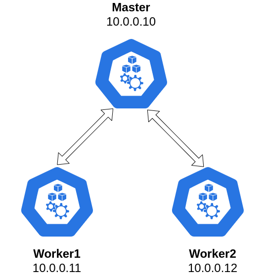

# **Local Kubernetes cluster provisioned via Ansible and Vagrant**

## **Scheme**


## **Testbed overview**

### Vbox networking configuration
To allow 10.0.x.x IP addresses, create the following file on the host machine: `/etc/vbox/networks.conf`        
Then add the following entries:
```shell
* 10.0.0.0/24 192.168.0.0/16
```

### Host machine
1. Ubuntu 20.04
2. Vagrant version == 2.3.4
3. Ansible version == 2.14.2
4. Python version == 3.9.2

### Vagrant VMs
1. Container runtime [cri-o](https://cri-o.io/)
2. Kubernetes version == 1.26.1. If required you can specify version via `--kubernetes-version [version]` option for `kubeadm` command
3. Calico network plugin from [https://raw.githubusercontent.com/projectcalico/calico/v3.25.0/manifests/calico.yaml](https://raw.githubusercontent.com/projectcalico/calico/v3.25.0/manifests/calico.yaml)

Join tokens are obtained via shared folders:
- On host machine: `host_share`
- On VM worker nodes: `guest_share`

To check functioning of the cluster:
1. Check Kubernetes components are up and running:
```shell
kubectl get po -n kube-system
```
2. Check worker nodes are up and running:
```shell
kubectl get no
```

## **Vagrant commands**
1. To start VMs:
```shell
vagrant up
```
2. To shutdown machines:
```shell
vagrant halt
```
3. To destroy machines:
```shell
vagrant destroy
```
4. To ssh into VM:
```ssh
vagrant ssh [vm_name]
```
5. To list all VMs:
```shell
vagrant global-status --prune
```

## **References**
1. [How to setup Kubernetes cluster with kubeadm on Ubuntu 20.04](https://brain2life.hashnode.dev/how-to-setup-kubernetes-cluster-with-kubeadm-on-ubuntu-2004)
2. [``apt-mark hold`` and ``apt-mark unhold`` with ansible modules](https://stackoverflow.com/questions/63982903/apt-mark-hold-and-apt-mark-unhold-with-ansible-modules)
3. [The IP address configured for the host-only network is not within the allowed ranges](https://stackoverflow.com/questions/70704093/the-ip-address-configured-for-the-host-only-network-is-not-within-the-allowed-ra)
4. [https://github.com/techiescamp/kubeadm-scripts](https://github.com/techiescamp/kubeadm-scripts)
5. [https://devopscube.com/setup-kubernetes-cluster-kubeadm/](https://devopscube.com/setup-kubernetes-cluster-kubeadm/)
6. [How to set Linux environment variables with Ansible](https://stackoverflow.com/questions/27733511/how-to-set-linux-environment-variables-with-ansible)
7. [Not possible to source .bashrc with Ansible](https://stackoverflow.com/questions/22256884/not-possible-to-source-bashrc-with-ansible)
8. [Reduce Vagrant code duplication by using functions](https://www.aaronsaray.com/2016/reduce-vagrant-code-duplication)